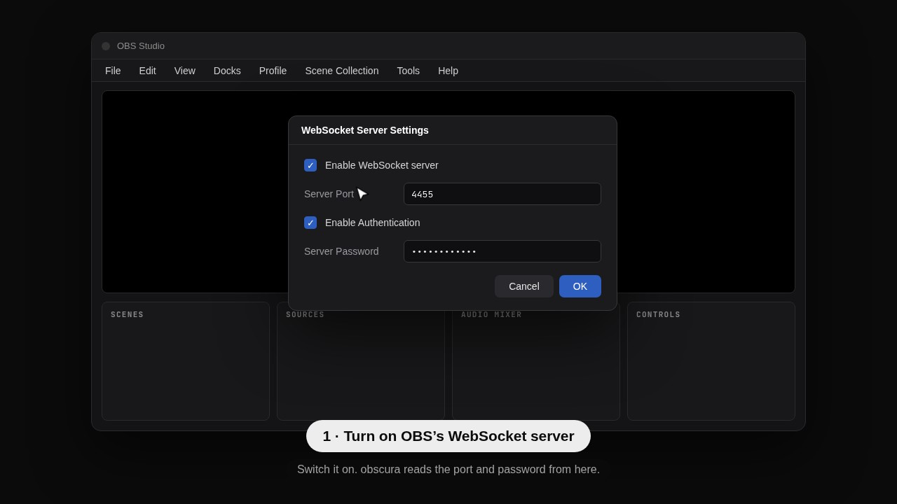

<p align="center"></p>

# obscura

A thin control layer for OBS Studio on Hyprland. A quiet button in your Quickshell bar that grows into a pill while you record, a panel for the details, and a shortcut that works from anywhere.

obscura drives the OBS you already have through its built-in WebSocket server (obs-websocket v5). It does not encode anything itself, so your scenes, sources and encoder settings stay in OBS.

*Türkçe: [README.tr.md](README.tr.md)*

> Status: early, usable. Built and tested on Hyprland with OBS Studio 32 and Quickshell 0.3; other setups are untested.

## What you get

- **A bar pill.** A circle while idle; while recording, a dot, the time and a stop button. It also shows paused, saved, and the states that need your attention (OBS closed, WebSocket server off, password needed).
- **A panel.** Start, pause and stop; switch scenes; mute audio sources with live level bars; save the replay buffer; take a screenshot. Choose the recording folder by browsing, set the file name pattern (the next file's name is shown, with a warning if it is taken), frame rate, resolution, container and replay length.
- **Frame rates that fit your screen.** The panel offers only what your display can show: a 144 Hz screen gets 120 and 144, a 60 Hz one does not get 120.
- **A shortcut that works from anywhere.** `obscura toggle` works with the bar closed, and opens OBS in the background if it is not running.
- **Hooks.** A notification when a recording is saved, optionally the path on the clipboard, and your own scripts.
- **A screen-share picker** drawn by your Quickshell setup instead of the stock portal dialog (optional, see below).

## Design goals

- **Idle costs nothing.** No polling loop. The client blocks on the socket; an idle process uses no CPU.
- **Never lie about state.** The recording dot lights only when OBS reports it started.
- **Fail fast.** If OBS is not running, a command returns in milliseconds with a clear message.
- **Zero config.** Port and password are read from OBS's own settings. Nothing is written back to OBS's config.

## Install

<p align="center"><a href="docs/video/obscura-install-en.mp4"></a><br><sub>▶ Watch the whole install (68 s, no sound)</sub></p>

<p align="center"></p>

From source (Rust 1.85 or newer):

```sh
git clone https://github.com/lunanoir21/obscura
cd obscura
cargo build --release
ln -s "$PWD/target/release/obscura" ~/.local/bin/obscura
obscura doctor
```

Enable the server in OBS first: Tools > WebSocket Server Settings. OBS 28 or newer.

Add the module to your Quickshell config and place the pill in your bar (`pal` is your colour object, `u` your scale unit):

```qml
import "vendor/obscura/ui" as Obscura

Obscura.ObscuraPill { pal: mocha; u: barWindow.s(1) }
// once, anywhere in the shell (only needed for the picker):
Obscura.ObscuraPickerHost {}
```

Bind keys in Hyprland:

```
bind = SUPER ALT, R, exec, obscura toggle
bind = SUPER ALT SHIFT, R, exec, obscura pause
```

## Command line

```sh
obscura doctor   # check OBS and its WebSocket server
obscura toggle   # start, or stop and print the saved file (opens OBS first if it is closed)
obscura open     # start OBS in the background, minimised, not recording
obscura status   # recording state as JSON
obscura pause
```

## Connection

obscura reads the port and password from OBS's own settings. To use another port, set it in the panel (Görünüm > OBS bağlantısı), with `obscura config set obs_port 4466`, or with `OBSCURA_PORT`. 0 means "use OBS's setting".

## Hooks

When a recording is saved obscura shows a notification and can copy the path to the clipboard (both switchable in the panel). Any executable in `~/.config/obscura/hooks/saved.d/` also runs, with the file path as `$1` and in `OBSCURA_PATH`.

## Screen-share picker

OBS asks for the screen through the desktop portal each time it starts, and the stock dialog does not match the rest of the desktop. obscura ships a picker for xdg-desktop-portal-hyprland that is drawn by the Quickshell widget (screens, windows, "remember this choice"). If the widget is not running, the stock dialog appears, so sharing never depends on obscura.

```sh
obscura picker-setup install     # writes custom_picker_binary into ~/.config/hypr/xdph.conf
systemctl --user restart xdg-desktop-portal-hyprland
obscura picker-setup uninstall   # back to the stock dialog
```

xdph does not say who is asking, so every app's share request (browser, Discord) uses this picker.

## Roadmap

- [x] CLI: start, stop, pause, status, open
- [x] Bar pill and `obscura watch`
- [x] Panel: scenes, audio sources and levels, replay buffer, recording settings, widget look
- [x] Screen-share picker
- [x] Shortcut, hooks, level meters
- [ ] Release: screenshots, packaging, other recorders behind the same button

## License

MIT
