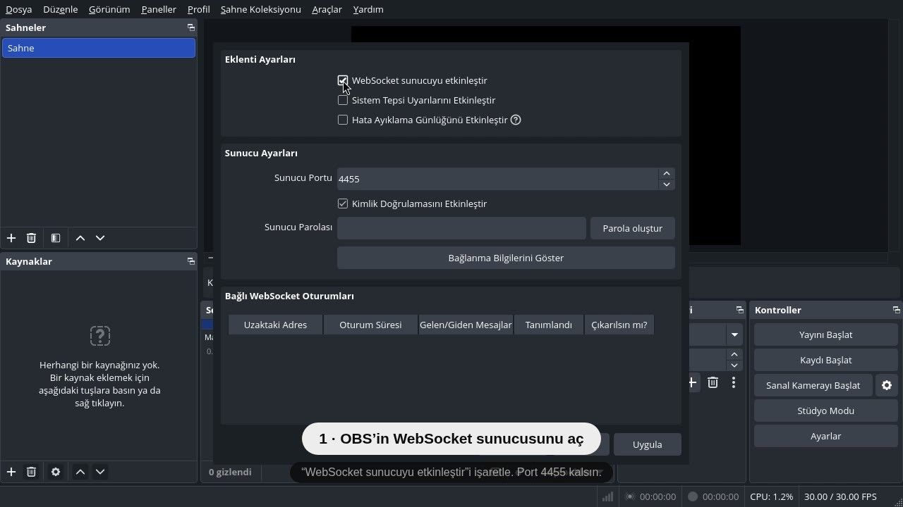

<p align="center"></p>

# obscura

Hyprland üzerinde OBS Studio için ince bir kontrol katmanı. Quickshell çubuğunda sessiz bir düğme; kayıt sırasında hapa açılır. Ayrıntılar için bir panel, her yerden çalışan bir kısayol sunar.

obscura, zaten kurulu olan OBS'i yerleşik WebSocket sunucusu (obs-websocket v5) üzerinden sürer. Kendisi kodlama yapmaz; sahne, kaynak ve kodlayıcı ayarların OBS'te kalır.

*English: [README.md](README.md)*

> Durum: erken ama kullanılabilir. Hyprland, OBS Studio 32 ve Quickshell 0.3 üzerinde derlenip denendi; diğer kurulumlar denenmedi.

## Neler var

- **Çubukta bir hap.** Boştayken daire; kayıtta nokta, süre ve durdur düğmesi. Duraklatıldı, kaydedildi ve dikkatini isteyen durumları da gösterir (OBS kapalı, WebSocket sunucusu kapalı, parola gerekli).
- **Bir panel.** Başlat, duraklat, durdur; sahne değiştir; ses kaynaklarını canlı seviye çubuklarıyla sessize al; replay buffer'ı kaydet; ekran görüntüsü al. Kayıt klasörünü gezerek seç, dosya adı kalıbını ayarla (sonraki dosyanın adı gösterilir, ad alınmışsa uyarı çıkar), kare hızı, çözünürlük, biçim ve replay süresini değiştir.
- **Ekranına uyan kare hızları.** Panel yalnız ekranının gösterebildiği seçenekleri sunar: 144 Hz ekran 120 ve 144 alır, 60 Hz ekran 120 almaz.
- **Her yerden çalışan kısayol.** `obscura toggle` çubuk kapalıyken de çalışır; OBS çalışmıyorsa onu arka planda açar.
- **Kancalar.** Kayıt kaydedilince bildirim, isteğe bağlı olarak yolun panoya kopyalanması ve kendi betiklerin.
- **Ekran paylaşımı seçici.** Stok portal diyaloğu yerine Quickshell kurulumunun çizdiği kart (isteğe bağlı, aşağıya bak).

## Tasarım hedefleri

- **Boştayken sıfır maliyet.** Yoklama döngüsü yok; istemci soket üzerinde bekler.
- **Duruma yalan söylemez.** Kayıt noktası yalnız OBS "başladı" dediğinde yanar.
- **Hızlı hata.** OBS kapalıysa komut milisaniyeler içinde net bir mesajla döner.
- **Sıfır yapılandırma.** Port ve parola OBS'in kendi ayarından okunur; OBS'in yapılandırmasına bir şey yazılmaz.

## Kurulum

<p align="center"><a href="docs/video/obscura-install-tr.mp4"></a><br><sub>▶ Kurulumun tamamını izle (74 sn, sessiz)</sub></p>

<p align="center"></p>

Kaynaktan (Rust 1.85 ya da yenisi):

```sh
git clone https://github.com/lunanoir21/obscura
cd obscura
cargo build --release
ln -s "$PWD/target/release/obscura" ~/.local/bin/obscura
obscura doctor
```

Önce OBS'te sunucuyu aç: Tools > WebSocket Server Settings. OBS 28 ya da yenisi gerekir.

Modülü Quickshell yapılandırmana ekle ve hapı çubuğuna yerleştir (`pal` renk nesnen, `u` ölçek birimin):

```qml
import "vendor/obscura/ui" as Obscura

Obscura.ObscuraPill { pal: mocha; u: barWindow.s(1) }
// bir kez, kabukta herhangi bir yerde (yalnız seçici için gerekir):
Obscura.ObscuraPickerHost {}
```

Hyprland'da tuşları bağla:

```
bind = SUPER ALT, R, exec, obscura toggle
bind = SUPER ALT SHIFT, R, exec, obscura pause
```

## Komut satırı

```sh
obscura doctor   # OBS ve WebSocket sunucusunu denetle
obscura toggle   # başlat, ya da durdur ve kaydedilen dosyayı yaz (OBS kapalıysa önce onu açar)
obscura open     # OBS'i arka planda aç; simge durumunda, kayıt başlatmadan
obscura status   # kayıt durumu JSON olarak
obscura pause
```

## Bağlantı

obscura port ve parolayı OBS'in kendi ayarından okur. Başka bir port için panelden (Görünüm > OBS bağlantısı), `obscura config set obs_port 4466` ile ya da `OBSCURA_PORT` ile ayarla. 0, "OBS'in ayarını kullan" demektir.

## Kancalar

Kayıt kaydedilince obscura bildirim gösterir ve isteğe bağlı olarak yolu panoya kopyalar (ikisi de panelden açılıp kapanır). `~/.config/obscura/hooks/saved.d/` içindeki her çalıştırılabilir dosya da, dosya yolu `$1` ve `OBSCURA_PATH` olarak verilerek çalışır.

## Ekran paylaşımı seçici

OBS her açılışta ekranı masaüstü portalından ister ve stok diyalog masaüstünün geri kalanına benzemez. obscura, xdg-desktop-portal-hyprland için Quickshell widget'ının çizdiği bir seçici sunar (ekranlar, pencereler, "bu seçimi hatırla"). Widget çalışmıyorsa stok diyalog açılır; yani paylaşım obscura'ya bağlı kalmaz.

```sh
obscura picker-setup install     # ~/.config/hypr/xdph.conf içine custom_picker_binary yazar
systemctl --user restart xdg-desktop-portal-hyprland
obscura picker-setup uninstall   # stok diyaloga dön
```

xdph isteği kimin yaptığını bildirmez; bu yüzden her uygulamanın (tarayıcı, Discord) paylaşım isteği bu seçiciyi kullanır.

## Yol haritası

- [x] Komut satırı: başlat, durdur, duraklat, durum, aç
- [x] Çubuk hapı ve `obscura watch`
- [x] Panel: sahneler, ses kaynakları ve seviyeleri, replay buffer, kayıt ayarları, widget görünümü
- [x] Ekran paylaşımı seçici
- [x] Kısayol, kancalar, seviye çubukları
- [ ] Sürüm: ekran görüntüleri, paketleme, aynı düğmenin arkasında başka kaydediciler

## Lisans

MIT
